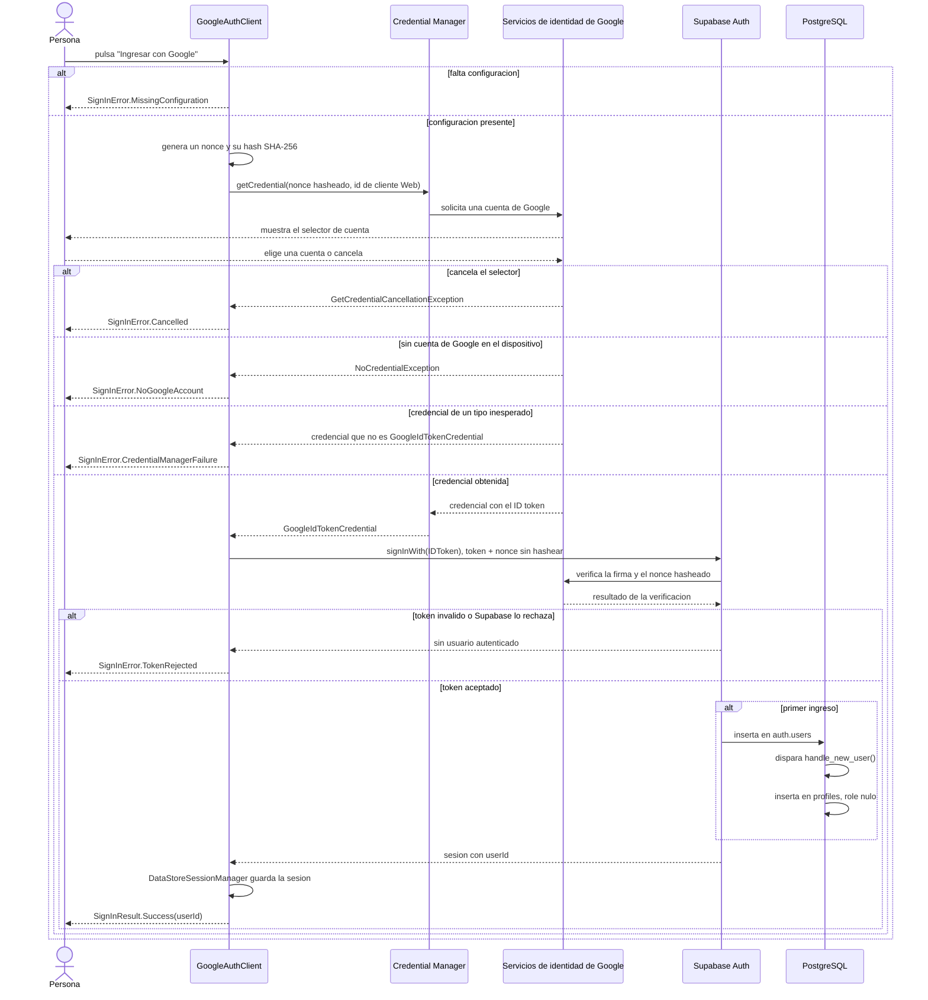

# Secuencia de autenticación con Google

Secuencia completa del ingreso, incluidos los cinco caminos de error que
`core/network/GoogleAuthClient.kt` modela como `SignInError`. Se deriva de ese
archivo, de `handle_new_user()` en la migración `functions`, y de la decisión de
usar Credential Manager con intercambio de token de identidad registrada en
`docs/decisions.md` (2026-09-05).

## Diagrama

## El nonce cruzado

Google firma sobre el **hash** del nonce; Supabase verifica contra el **valor
crudo**. `GoogleAuthClient` genera ambos con `Nonce.generate()` y los envía cada
uno a quien lo espera: el hasheado a `GetGoogleIdOption.setNonce()`, el crudo a
`signInWith(IDToken) { nonce = ... }`. Invertirlos produce un rechazo silencioso,
no un error legible, así que `NonceTest` fija por separado que el nonce se
hashea con SHA-256 en minúsculas y que cada nonce crudo se empareja con su
propio hash.

## Por qué el identificador de cliente es el Web

`GetGoogleIdOption.setServerClientId()` recibe el identificador de cliente
**Web**, no el de Android, porque el token va dirigido a Supabase —el
servidor—, no a esta aplicación. Usar el de Android hace que Supabase rechace
el token con `SignInError.TokenRejected`. Registrado en `docs/decisions.md`
(2026-09-05).

## Dónde nace `profiles`

`handle_new_user()` es un disparador sobre `auth.users`, no una llamada que
haga el cliente: la fila de `profiles` aparece sola en el primer ingreso, con
`role` nulo hasta que la persona elige si es paciente o profesional (HU-02). Si
alguna vez `profiles` no se crea al ingresar por primera vez, el disparador —no
el cliente— es lo primero que hay que revisar.

## Los cinco errores y dónde se traducen

`SignInError` es un tipo sellado sin ninguna frase: `AuthSmokeTestScreen.kt`
traduce cada variante a una clave de recurso, nunca al revés.

| Variante | Cuándo ocurre | Clave de recurso |
|---|---|---|
| `MissingConfiguration` | `local.properties` no tiene las tres credenciales | `error_sign_in_missing_configuration` |
| `Cancelled` | La persona cierra el selector de cuenta | `error_sign_in_cancelled` |
| `NoGoogleAccount` | El dispositivo no tiene ninguna cuenta de Google | `error_sign_in_no_google_account` |
| `CredentialManagerFailure` | Credential Manager falla o devuelve un tipo de credencial inesperado | `error_sign_in_credential_manager_failure` |
| `TokenRejected` | Supabase no acepta el token | `error_sign_in_token_rejected` |

## Vigencia de este diagrama

La pantalla que dispara hoy esta secuencia, `AuthSmokeTestScreen`, es código
desechable (plan.md, HT-05): desaparece en HU-01. La secuencia en sí —Credential
Manager, el nonce cruzado, el disparador de `profiles`— es la que HU-01
construye de forma permanente, así que este documento sobrevive al cambio de
pantalla.
