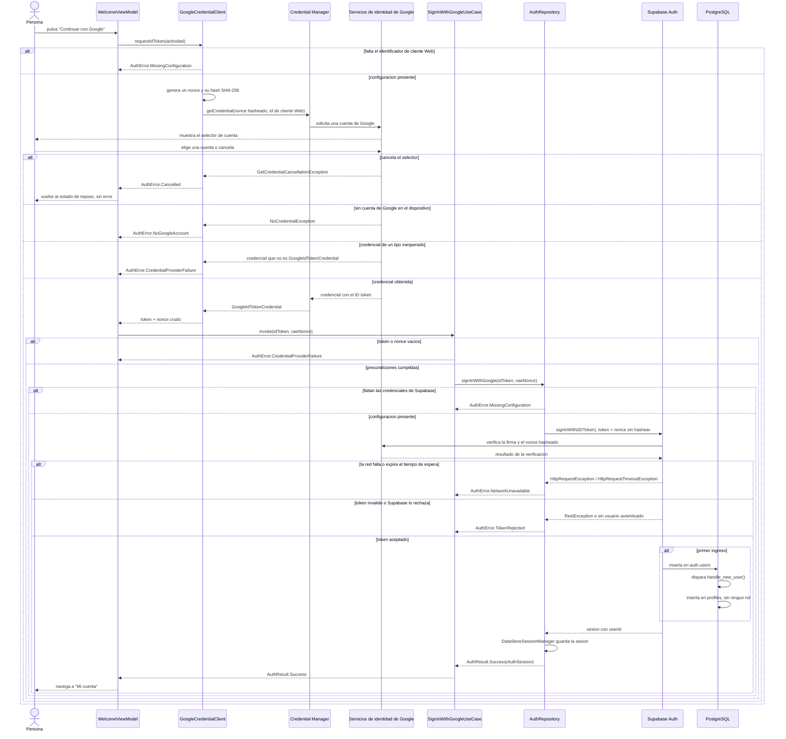
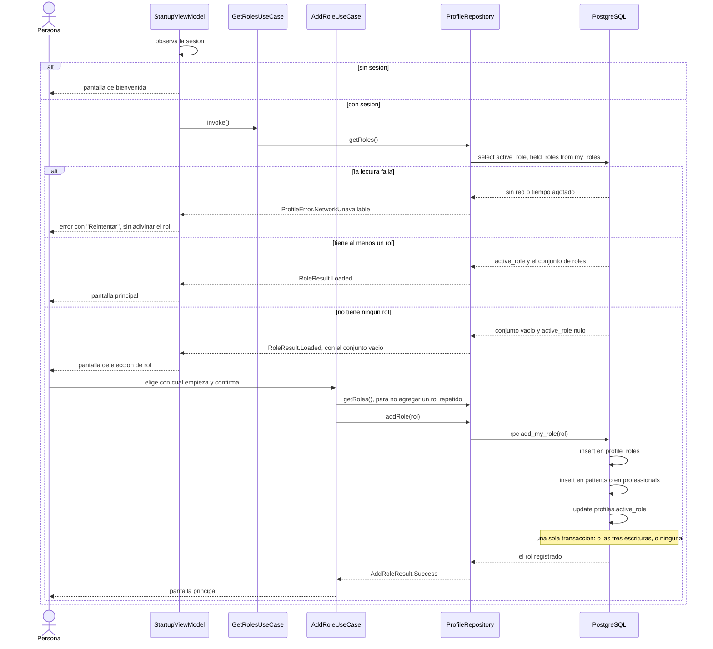

# Secuencia de autenticación con Google

Secuencia completa del ingreso, incluidos los caminos de error que la capa de
dominio modela como `AuthError`. Se deriva de los archivos de
`features/auth/`, de `handle_new_user()` en la migración `functions`, y de la
decisión de usar Credential Manager con intercambio de token de identidad
registrada en `docs/decisions.md` (2026-09-05).

**El recorrido está repartido entre tres piezas y ninguna hace más de lo suyo:**
`GoogleCredentialClient`, en la capa de presentación, es el único que habla con
Credential Manager y el único que necesita una actividad;
`SignInWithGoogleUseCase` valida el token y el nonce antes de que crucen al
dominio; `AuthRepository`, sobre `SupabaseAuthDataSource`, hace el intercambio
con Supabase y es el único lugar donde una excepción de la biblioteca se
convierte en un tipo de error. El motivo del reparto está en
`docs/decisions.md` (2026-09-12).

## Diagrama

## El nonce cruzado

Google firma sobre el **hash** del nonce; Supabase verifica contra el **valor
crudo**. `GoogleCredentialClient` genera ambos con `Nonce.generate()` y los
envía cada uno a quien lo espera: el hasheado a `GetGoogleIdOption.setNonce()`,
el crudo viaja hasta `signInWith(IDToken) { nonce = ... }`. Invertirlos produce
un rechazo silencioso, no un error legible, así que hay dos pruebas que lo
fijan: `NonceTest` comprueba que el hash es SHA-256 en minúsculas y que cada
nonce crudo se empareja con el suyo, y `SignInWithGoogleUseCaseTest` comprueba
que el caso de uso entrega al repositorio el token y el nonce crudo en ese
orden, sin intercambiarlos.

## Por qué el identificador de cliente es el Web

`GetGoogleIdOption.setServerClientId()` recibe el identificador de cliente
**Web**, no el de Android, porque el token va dirigido a Supabase —el
servidor—, no a esta aplicación. Usar el de Android hace que Supabase rechace
el token con `AuthError.TokenRejected`. Registrado en `docs/decisions.md`
(2026-09-05).

## Dónde nace `profiles`

`handle_new_user()` es un disparador sobre `auth.users`, no una llamada que
haga el cliente: la fila de `profiles` aparece sola en el primer ingreso, con
`role` nulo hasta que la persona elige si es paciente o profesional (HU-02). Si
alguna vez `profiles` no se crea al ingresar por primera vez, el disparador —no
el cliente— es lo primero que hay que revisar.

## La puerta del rol, después del ingreso

RF-01.4 exige que quien no tiene rol lo elija **antes de cualquier otra
funcionalidad**, así que la decisión no vive en la pantalla de bienvenida sino
en el arranque: `StartupViewModel` resuelve sesión y rol juntos y devuelve un
único destino. Por eso el ingreso no navega a la pantalla principal, sino de
vuelta al arranque: es el único lugar que sabe decidir, y hacerlo dos veces en
dos lugares distintos es como se desincronizan.

**Por qué la escritura es una función almacenada.** Agregar el rol, crear la fila
del rol y dejarlo activo son tres operaciones, y desde el cliente serían tres
peticiones. Si una fallara a mitad de camino, la persona quedaría con un rol sin
la fila que lo sostiene, o con un rol que tiene pero no puede activar, y nada
volvería a intentarlo. `add_my_role` es el caso 1 de
`.claude/rules/supabase.md`, la transacción atómica que el cliente no puede
garantizar. Registrado en `docs/decisions.md`, 2026-09-13 y 2026-10-01.

**Un rol que no se puede leer no es un rol que falta.** Si la lectura falla, el
arranque se detiene en un error con «Reintentar» en vez de suponer que no hay
rol. Suponerlo pondría a alguien que ya eligió frente a la pregunta otra vez, y
la base de datos rechazaría su respuesta con `role_already_held`.
`StartupViewModelTest` fija las dos mitades.

**Cambiar de rol no aparece en este diagrama porque no pasa por el arranque.**
Vive en «Mi cuenta» y es una actualización directa de `profiles.active_role` a
través de `profiles_update_own`: una sola columna, sin nada que pueda quedar a
medias, y con la clave foránea compuesta garantizando que el rol activo sea uno
de los que la persona tiene. Registrado en `docs/decisions.md`, 2026-10-01.

## Los errores y dónde se traducen

`AuthError` es un tipo sellado sin ninguna frase.
`features/auth/presentation/AuthErrorMessages.kt` traduce cada variante a una
clave de recurso, nunca al revés, de modo que la regla de negocio no conoce el
idioma del usuario (`.claude/rules/i18n.md`).

| Variante | Cuándo ocurre | Clave de recurso |
|---|---|---|
| `MissingConfiguration` | `local.properties` no tiene las credenciales | `error_sign_in_missing_configuration` |
| `Cancelled` | La persona cierra el selector de cuenta | ninguna: el modelo de vista lo convierte en reposo antes de llegar a la pantalla |
| `NoGoogleAccount` | El dispositivo no tiene ninguna cuenta de Google | `error_sign_in_no_google_account` |
| `CredentialProviderFailure` | Credential Manager falla, devuelve un tipo de credencial inesperado, o entrega un token vacío | `error_sign_in_credential_provider_failure` |
| `NetworkUnavailable` | La petición no llega a Supabase, o expira el tiempo de espera | `error_network_unavailable` |
| `TokenRejected` | Supabase no acepta el token | `error_sign_in_token_rejected` |
| `Unexpected` | Cualquier otra falla | `error_unexpected` |

**`Cancelled` es el único que nunca se muestra.** Cerrar el selector es una
decisión, no un fallo: `WelcomeViewModel` lo convierte en el estado de reposo y
la pantalla vuelve intacta, con el botón disponible. Es un criterio de
aceptación de HU-01 y `WelcomeViewModelTest` lo fija.

**Cuidado con el tiempo de espera agotado.** supabase-kt relanza
`HttpRequestTimeoutException` sin envolverla y solo envuelve las demás fallas de
transporte en su propia `HttpRequestException`, así que ambas tienen que
reconocerse por separado para que una conexión lenta no se presente como una
falla inexplicable. `AuthErrorMapperTest` lo fija. Registrado en
`docs/decisions.md` (2026-09-13).

## Qué ocurre al cerrar sesión

`SignOutUseCase` llega al mismo repositorio. El alcance del cierre es local, y
cuando la petición al servidor no llega —sin red o con el tiempo agotado— el
repositorio limpia igual la sesión guardada y lo informa como éxito, porque de
lo contrario la persona pulsaría «Cerrar sesión» y volvería a encontrar su
cuenta abierta. Registrado en `docs/decisions.md` (2026-09-12).
