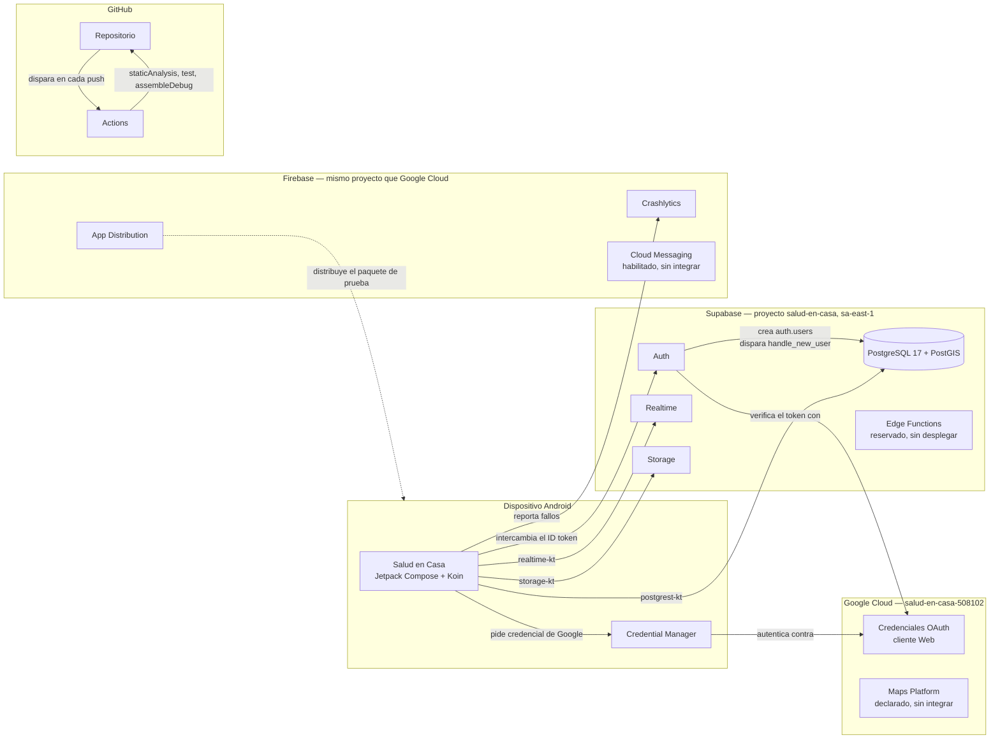

# Componentes y servicios externos

Qué habla con qué, y con qué protocolo o biblioteca. Se deriva de
`gradle/libs.versions.toml`, `app/build.gradle.kts`, `di/CoreModule.kt`,
`di/AuthModule.kt`, `features/auth/` —donde `GoogleCredentialClient` habla con
Credential Manager y `SupabaseAuthDataSource` con Supabase—,
`.github/workflows/ci.yml` y las decisiones registradas en `docs/decisions.md`.
Si alguno de esos archivos cambia de forma que esta relación deje de ser cierta,
este diagrama cambia con él.

## Diagrama

## Por qué Google Cloud y Firebase son el mismo proyecto

`salud-en-casa-508102` es a la vez el proyecto de Google Cloud que emite las
credenciales OAuth y el proyecto de Firebase que aloja Crashlytics, Cloud
Messaging y App Distribution. Firebase se apoya en Google Cloud por diseño: al
crear un proyecto de Firebase, se crea o se vincula un proyecto de Google Cloud
con el mismo identificador. No son dos proyectos que coincidan por casualidad.

## Lo que está declarado pero todavía no está integrado

Tres piezas figuran en el catálogo de dependencias o en la configuración de un
servicio externo, pero ningún código del cliente las usa todavía. Aparecen en el
diagrama para que la documentación no quede por detrás de la infraestructura, y
llevan la etiqueta que explica por qué:

| Componente | Qué falta | Historia que lo integrará |
|---|---|---|
| **Maps Platform** | `maps-compose` y `play-services-location` están en `gradle/libs.versions.toml`, pero ningún archivo de compilación los declara como dependencia todavía | HU-05, HU-11 (búsqueda por cercanía) |
| **Cloud Messaging** | Habilitado en la consola de Firebase desde HT-02, sin SDK ni código que reciba una notificación | Notificación de solicitudes cercanas, Sprint 4 en adelante |
| **Edge Functions** | Reservadas para las tres operaciones que `.claude/rules/supabase.md` describe (transacciones atómicas, operaciones privilegiadas, webhooks de pago). Ninguna existe: `supabase/` no tiene un directorio `functions/` | La primera es la aceptación de una oferta (RF-08.5), pendiente según `docs/decisions.md`, 2026-09-12 |

## Relación con la integración continua

`Actions` no toca la base de datos: `staticAnalysis`, `test` y `assembleDebug`
corren contra código y, cuando hace falta un secreto, contra credenciales de
desarrollo, pero ninguna migración se aplica desde el flujo. Las migraciones se
aplican a mano, desde la máquina de quien desarrolla, con `npx supabase db
push` — ver `docs/architecture/deployment.md`.

## Región y nivel de servicio

El proyecto de Supabase vive en `sa-east-1` (São Paulo), la región más cercana a
Bolivia entre las que ofrece el proveedor. Es el proyecto de desarrollo, en el
nivel gratuito: `docs/decisions.md` (2026-09-08) registra por qué el proyecto de
producción se crea recién al acercarse el Sprint 10.
