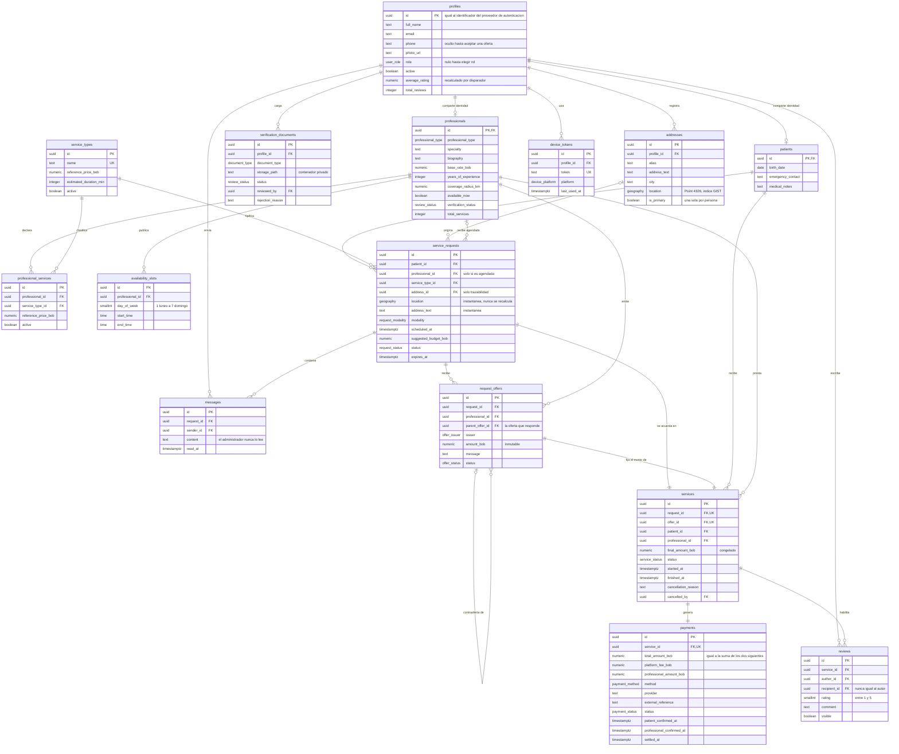

# Modelo de datos

Diagrama entidad-relación del esquema, derivado de las migraciones aplicadas en
`supabase/migrations/`. Si el esquema cambia, este archivo cambia en la misma
migración.

Los identificadores están en inglés y los textos en español, según la regla de
idioma de `CLAUDE.md`.

## Diagrama

## Las quince tablas

| Tabla | Qué guarda | Migración |
|---|---|---|
| `profiles` | La identidad única de toda persona y su reputación | `identity` |
| `patients` | Los datos propios del rol paciente | `identity` |
| `professionals` | Los datos propios del rol profesional y su verificación | `identity` |
| `verification_documents` | Respaldos de identidad y título, con el resultado de su revisión | `identity` |
| `addresses` | Domicilios georreferenciados de cada persona | `identity` |
| `service_types` | Catálogo de tipos de atención de la plataforma | `catalog` |
| `professional_services` | Qué tipos presta cada profesional y a qué precio | `catalog` |
| `availability_slots` | Franjas horarias semanales declaradas | `catalog` |
| `service_requests` | Peticiones de atención, inmediatas o agendadas | `requests` |
| `request_offers` | Hilo de ofertas y contraofertas sobre una solicitud | `requests` |
| `messages` | Conversación de la solicitud y detalle de la atención | `requests` |
| `services` | La atención acordada, con su monto congelado | `delivery` |
| `payments` | Registro económico y confirmación de ambas partes | `delivery` |
| `reviews` | Calificaciones cruzadas sobre una atención completada | `delivery` |
| `device_tokens` | Destinos de notificación por persona | `support` |

## Dónde se hace cumplir cada invariante

La columna de la derecha es lo que hay que revisar si alguna vez se sospecha que
un invariante dejó de cumplirse.

| Invariante | Mecanismo |
|---|---|
| INV-01 · `profiles` es la identidad única | Clave primaria de `patients` y `professionals` referida a `profiles.id`, que a su vez referencia `auth.users` |
| INV-02 · Toda tabla con RLS y política | `enable row level security` y al menos una política en la migración que crea cada tabla |
| INV-03 · `service_requests.location` es instantánea | Disparador `service_requests_guard_location` |
| INV-04 · `services.final_amount_bob` congelado | Disparador `services_guard_frozen` |
| INV-05 · No se corrige el histórico | Sin política de borrado en `services`, `payments`, `request_offers` ni `reviews`; disparadores `services_guard_transition` y `payments_guard_frozen` |
| INV-06 · Ofertas de solo agregar | Disparador `request_offers_guard_append_only` y ausencia de política de borrado |
| INV-07 · Solo profesionales aprobados y activos | Vista `professional_directory`, filtro de `search_nearby_professionals` y restricción `professionals_approved_profile_is_complete`, que impide aprobar un profesional sin tipo ni tarifa |
| INV-08 · Cercanía con PostGIS | `search_nearby_professionals` con `st_dwithin` sobre el índice GIST `idx_addresses_location` |
| INV-09 · Pago confirmado solo por ambas partes | Restricción `confirmations_match_status` y disparador `payments_guard_confirmation` |
| INV-10 · Total igual a comisión más monto del profesional | Restricción `total_equals_fee_plus_professional_amount` |
| INV-11 · Calificación única, de 1 a 5, autor distinto del destinatario | Restricciones `unique (service_id, author_id)`, `rating between 1 and 5` y `author_is_not_recipient` |
| INV-12 · El administrador no accede a `messages` | Ninguna política de `messages` invoca `is_admin()`, en esta ni en ninguna migración posterior |
| INV-13 · Nadie lee filas ajenas | Políticas por `auth.uid()` en las quince tablas |
| INV-14 · La clave de servicio no sale del servidor | Fuera del esquema: `local.properties` y secretos del repositorio |

## Tipos enumerados

Los doce tipos viven en la migración `extensions_and_types`. Sus valores se
escriben en `SCREAMING_SNAKE_CASE` para que correspondan uno a uno con las
constantes de Kotlin.

`user_role` · `review_status` · `professional_type` · `document_type` ·
`request_modality` · `request_status` · `offer_issuer` · `offer_status` ·
`service_status` · `payment_method` · `payment_status` · `device_platform`

## Vista y funciones

| Objeto | Para qué |
|---|---|
| `professional_directory` | Proyección pública del profesional. La seguridad a nivel de fila no puede ocultar una sola columna, así que la ficha pública es una vista que simplemente no contiene el teléfono |
| `search_nearby_professionals` | Búsqueda por cercanía. Devuelve distancia y ordena de forma ascendente. Es la única vía de la búsqueda geográfica |
| `handle_new_user` | Crea el perfil al primer ingreso, con el rol sin asignar |
| `save_my_profile` | Escribe `profiles` y, según el rol guardado, `patients` o `professionals`, en una sola transacción. Lee el rol del servidor en vez de recibirlo del cliente, de modo que un argumento que no corresponde al rol se ignora en vez de escribirse. No toca `available_now`: esa columna la escribe el interruptor de disponibilidad por su cuenta |
| `assign_my_role` | Escribe el rol elegido y crea la fila de `patients` o de `professionals` en una sola transacción. `security invoker`: cada escritura ya la permite la política del propio usuario, de modo que la función aporta atomicidad y nada más |
| `recalculate_reputation` | Recalcula `average_rating` y `total_reviews` en cada calificación |
| `is_admin`, `shares_service_with`, `professional_covers` | Auxiliares que usan las políticas |

`search_nearby_professionals`, `handle_new_user`, `recalculate_reputation`,
`is_admin` y `shares_service_with` son `security definer` porque deben leer filas
que el usuario no puede leer por sí mismo. Todas declaran `set search_path = ''`
y califican cada objeto con su esquema.

`assign_my_role` y `save_my_profile` son la excepción: son `security invoker`,
porque no necesitan saltarse ninguna política. Existe por la atomicidad. Dos escrituras separadas
desde el cliente no pueden garantizarla, y si la segunda fallara la persona
quedaría con un rol sin la fila que lo sostiene, sin que nada lo reintentara
(`docs/decisions.md`, 2026-09-13).

**`professionals.professional_type` y `professionals.base_rate_bob` nacen
nulos.** RF-01.4 pide el rol antes que cualquier otra funcionalidad y RF-02.2
pone el tipo y la tarifa en el perfil profesional, que HU-04 recoge después. Un
campo en blanco en esa pantalla sigue guardándose como nulo, porque es alguien
que todavía no declaró el dato. La restricción
`professionals_approved_profile_is_complete` impide que un profesional
incompleto llegue a `APPROVED`, que es la condición que
`professional_directory` y `search_nearby_professionals` exigen para mostrarlo
(INV-07).

**`professionals.coverage_radius_km` admite de 1 a 50 kilómetros.** La columna
se creó aceptando cualquier valor mayor que cero; HU-04 fija el rango que la
historia enuncia y lo cierra en el motor con
`professionals_coverage_radius_km_range`, de modo que la regla no dependa de
que la petición venga de la aplicación.

## Lo que este esquema no incluye, de forma deliberada

- **Registro clínico estructurado.** Fuera de alcance (FA-01). El detalle de la
  atención vive en `messages`. No existe una columna de notas en `services`, y no
  debe crearse: el registro clínico se incorporará como tabla propia con autoría,
  fecha y semántica de solo agregar.
- **Base de datos local en el cliente.** Ningún requisito exige operación sin
  conexión (FA-08).
- **Pasarela de pagos.** `payments` ya contempla `method`, `provider` y
  `external_reference` para incorporarla sin cambio de esquema (FA-02).
