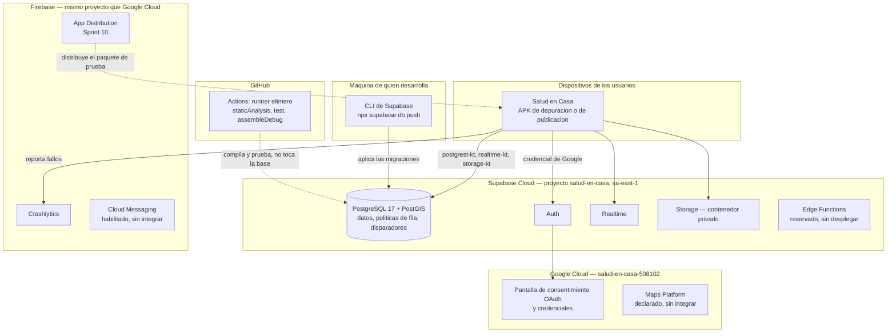

# Despliegue

Dónde se ejecuta cada componente, y con qué mecanismo llega ahí. Complementa a
`components.md`, que muestra las relaciones; este documento muestra la
ubicación física y quién publica cada pieza.

## Diagrama

## Dónde vive cada pieza

| Componente | Dónde corre | Quién lo publica ahí |
|---|---|---|
| La aplicación | El dispositivo de cada persona | Hoy, `./gradlew installDebug` o App Distribution en el Sprint 10. Play Store queda fuera de alcance en esta fase (`docs/decisions.md`, 2026-09-08) |
| PostgreSQL, Auth, Realtime, Storage | Supabase Cloud, región `sa-east-1`, proyecto de desarrollo | Quien desarrolla, con `npx supabase db push` desde su máquina |
| Edge Functions | Reservado, sin desplegar | Ninguna existe todavía; ver `components.md` |
| Credenciales OAuth | Google Cloud, proyecto `salud-en-casa-508102` | Configuración manual en la consola (HT-02) |
| Crashlytics, Cloud Messaging, App Distribution | Firebase, mismo proyecto que Google Cloud | Configuración manual en la consola; Crashlytics además recibe el SDK compilado en la aplicación (HT-08) |
| El repositorio y el flujo de integración continua | GitHub | Cada envío dispara un ejecutor efímero que se destruye al terminar |

## Por qué las migraciones no viajan por integración continua

`npx supabase db push` se ejecuta a mano, nunca desde `.github/workflows/ci.yml`.
El flujo compila, analiza y prueba con las credenciales de un proyecto de
desarrollo compartido; dejar que cualquier envío modifique el esquema de ese
mismo proyecto convertiría cada `push` en una operación con efecto sobre una
base de datos compartida, sin revisión previa. Aplicar el esquema es una
decisión deliberada de quien desarrolla, documentada en `README.md`.

## Un solo entorno, por ahora

Existe únicamente el proyecto de desarrollo, tanto en Supabase como en Firebase
y Google Cloud. `docs/decisions.md` (2026-09-08) registra por qué el proyecto de
producción se crea recién al acercarse el Sprint 10: mantenerlo activo antes de
tener usuarios reales sería pagar meses de un servicio sin uso. Este diagrama
describe el entorno de desarrollo; cuando exista un entorno de producción,
este documento se actualiza para mostrar ambos.

## Qué no está desplegado, de forma deliberada

- **Edge Functions.** `.claude/rules/supabase.md` las reserva para tres casos
  —transacciones atómicas, operaciones privilegiadas, webhooks de pago— y
  ninguno de los tres tiene todavía la historia que lo construya.
- **Maps Platform.** Declarado en el catálogo de dependencias, sin ninguna
  llamada del cliente todavía (HU-05, HU-11).
- **Entorno local de Supabase con Docker.** `supabase start` y `supabase db
  reset` quedan fuera de alcance en esta etapa (`docs/decisions.md`, HT-04): se
  trabaja siempre contra el proyecto remoto de desarrollo.
