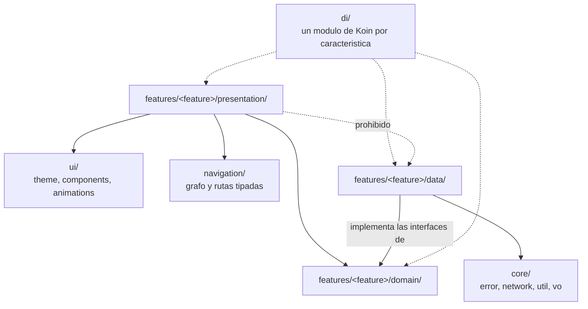
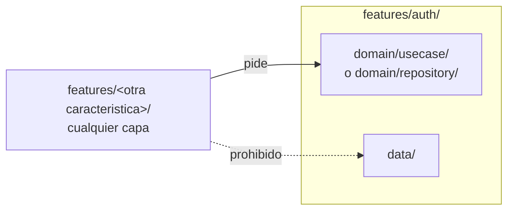

# Estructura de paquetes y regla de dependencia

El proyecto es un solo módulo Gradle, `:app`, con paquetes por característica.
`.claude/rules/arquitectura.md` fija la estructura y la regla de dependencia;
este documento la dibuja. Nada aquí sustituye esa regla: la resume para que se
vea de un vistazo.

**El compilador no hace cumplir nada de esto.** Al ser un solo módulo, cualquier
clase puede importar cualquier otra sin que Gradle se queje. Lo que sostiene la
regla es la disciplina de revisión y, desde HT-08,
`ArchitectureRulesTest` en `app/src/test/java/bo/saludencasa/architecture/`, que
falla la compilación si alguna de las tres flechas prohibidas de este documento
aparece en el código.

## Dentro de una característica

`domain/` no tiene ninguna flecha de salida en este diagrama, y es a propósito:
no depende de Compose, de Android ni del cliente de Supabase, lo que
`ArchitectureRulesTest.domainLayerHasNoPlatformImports` (la prueba obligatoria
`domainLayerHasNoPlatformImports` de `.claude/rules/testing.md`) verifica
buscando importaciones de `androidx.*`, `android.*` e
`io.github.jan.supabase.*` en cada archivo bajo `domain/` y bajo `core/vo/`.

`core/vo/` guarda los objetos de valor que comparten varias características
—`Email`, `PhoneNumber`, `PersonName`—. Es código de dominio que no pertenece a
ninguna característica, de modo que la regla anterior lo alcanza igual; la
alternativa, que una característica dependa del `domain` de otra solo para
obtener un objeto de valor, invierte la razón de haberlas separado
(`docs/decisions.md`, 2026-09-12).

`di/` inyecta hacia las tres capas —de ahí las flechas punteadas—, pero ninguna
capa inyecta hacia `di/`: la dirección de la inyección de dependencias es la
inversa de la dirección en que Koin resuelve los módulos.

## Entre dos características

Una característica que necesita algo de otra lo pide por su caso de uso o por
su interfaz de repositorio — nunca importando su capa `data` directamente. La
regla es simétrica: aplica igual sin importar cuál de las dos características
pide y cuál provee.

## Estado real hoy

`features/auth/` existe con sus tres capas desde HU-01: `domain/` con los
modelos, la interfaz `IAuthRepository` y los tres casos de uso; `data/` con
`SupabaseAuthDataSource`, el transformador y `AuthRepository`; y `presentation/`
con las tres pantallas, sus modelos de vista y `GoogleCredentialClient`. La
pantalla de prueba de conexión de HT-05 desapareció con ella.

`features/profile/` es la segunda, desde HU-02, y también atraviesa las tres
capas: `domain/` con `UserRole`, `AssignableRole`, `UserProfile` y los casos de
uso de leer y elegir el rol y de leer y guardar el perfil; `domain/vo/` con
`BirthDate`; `data/` con `SupabaseProfileDataSource`, que lee y escribe
`profiles` y `patients` y llama a `assign_my_role`; y `presentation/` con la
pantalla de elección de rol y la de perfil.

`BirthDate` vive en `features/profile/domain/vo/` y no en `core/vo/` porque
ninguna otra característica lo usa. Es la primera vez que el proyecto ocupa ese
hueco de la estructura: `Email`, `PhoneNumber` y `PersonName` viven en
`core/vo/` porque los comparten varias (`docs/decisions.md`, 2026-09-12). La
regla que mantiene el dominio libre de plataforma alcanza a los dos lugares.

**La tercera regla de dependencia deja de ser teórica con esta segunda
característica.** Hasta HU-01 no había dos características entre las que
cruzarse. Ahora sí las hay, y el cruce existe y es del tipo permitido:
`StartupViewModel`, en `features/auth/presentation/`, consume
`GetRoleUseCase`, que vive en `features/profile/domain/usecase/`. Pide por el
caso de uso, nunca por `features/profile/data/`, que es exactamente lo que
`ArchitectureRulesTest.featureNeverImportsTheDataLayerOfAnotherFeature`
vigila. Esa prueba se había verificado en HT-08 provocando su fallo con
archivos sonda desechables; desde HU-02 recorre un cruce real.

La regla que protege `domain/` y `core/vo/` se verificó del mismo modo al
cerrar HU-01.

Ninguna otra característica existe todavía.
