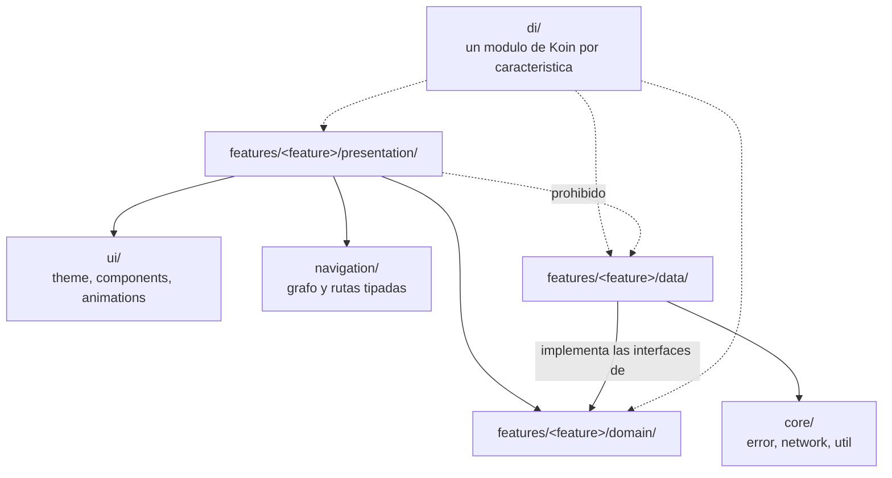
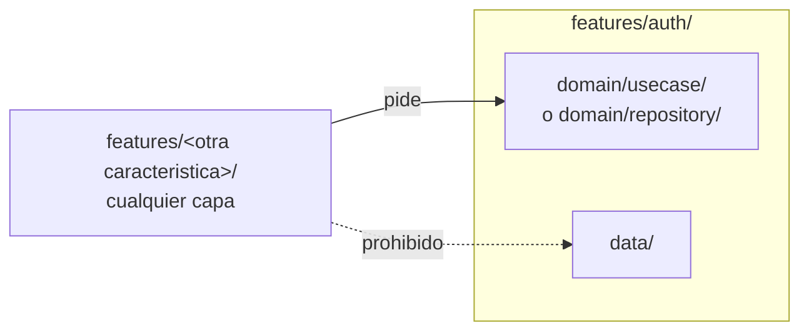

# Estructura de paquetes y regla de dependencia

El proyecto es un solo módulo Gradle, `:app`, con paquetes por característica.
`.claude/rules/arquitectura.md` fija la estructura y la regla de dependencia;
este documento la dibuja. Nada aquí sustituye esa regla: la resume para que se
vea de un vistazo.

**El compilador no hace cumplir nada de esto.** Al ser un solo módulo, cualquier
clase puede importar cualquier otra sin que Gradle se queje. Lo que sostiene la
regla es la disciplina de revisión y, desde HT-08,
`ArchitectureRulesTest` en `app/src/test/java/bo/saludencasa/architecture/`, que
falla la compilación si alguna de las tres flechas prohibidas de este documento
aparece en el código.

## Dentro de una característica

`domain/` no tiene ninguna flecha de salida en este diagrama, y es a propósito:
no depende de Compose, de Android ni del cliente de Supabase, lo que
`ArchitectureRulesTest.domainLayerHasNoPlatformImports` (la prueba obligatoria
`domainLayerHasNoPlatformImports` de `.claude/rules/testing.md`) verifica
buscando importaciones de `androidx.*`, `android.*` e
`io.github.jan.supabase.*` en cada archivo bajo `domain/`.

`di/` inyecta hacia las tres capas —de ahí las flechas punteadas—, pero ninguna
capa inyecta hacia `di/`: la dirección de la inyección de dependencias es la
inversa de la dirección en que Koin resuelve los módulos.

## Entre dos características

Una característica que necesita algo de otra lo pide por su caso de uso o por
su interfaz de repositorio — nunca importando su capa `data` directamente. La
regla es simétrica: aplica igual sin importar cuál de las dos características
pide y cuál provee.

## Estado real hoy

Solo existe `features/auth/presentation/`, con la pantalla de prueba de
conexión de HT-05. No hay todavía ningún paquete `domain/` ni `data/` en el
proyecto, así que dos de las tres reglas de este documento —la que protege
`domain/` y la que impide que una característica importe la `data/` de
otra— no tienen todavía ninguna violación posible que atrapar. Se verificaron
de todos modos provocando su fallo con archivos de prueba desechables antes de
cerrar HT-08, precisamente para no dejar una prueba que pasa en verde sin haber
mirado nunca nada; el registro de ese experimento está en `plan.md`, HT-08.

`features/auth/presentation/` desaparece con HU-01, que construye las pantallas
reales de ingreso y sí atraviesa las tres capas.
